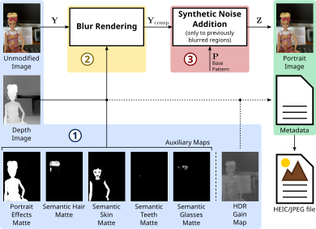
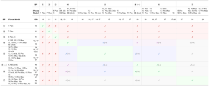
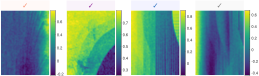
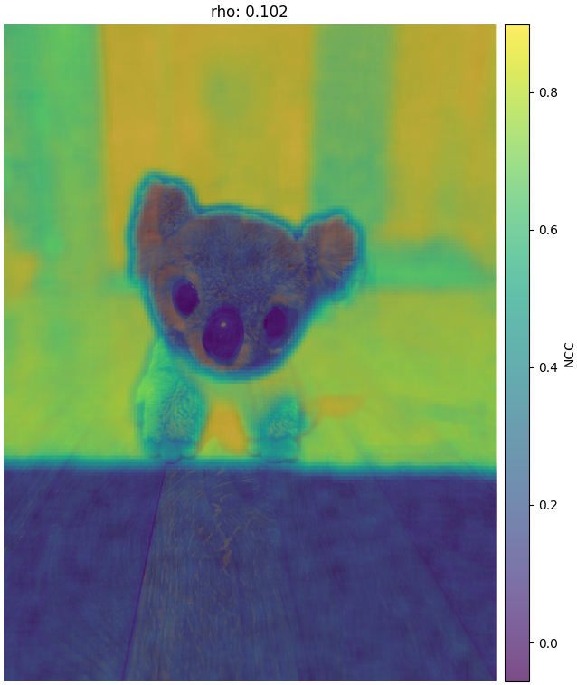
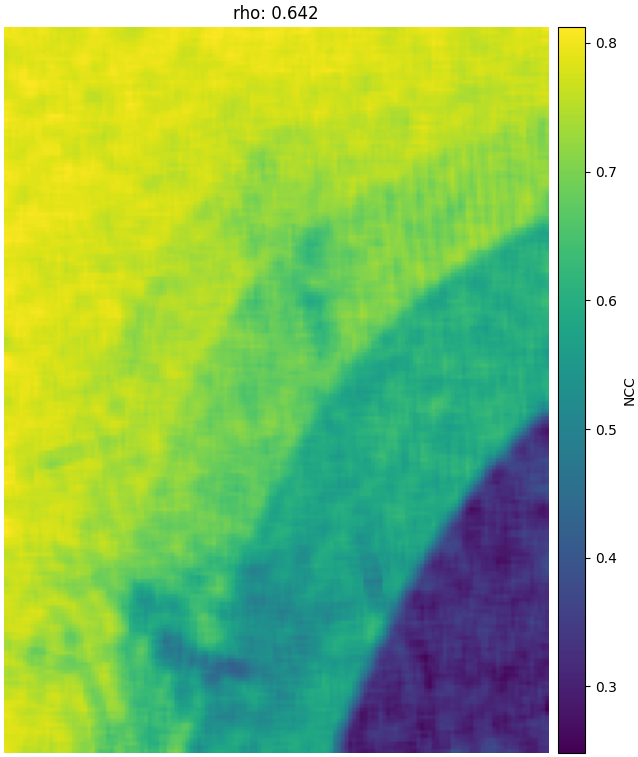

# Apple's Synthetic Defocus Noise Pattern (SDNP)
Official repository for the paper:

> D. Vázquez-Padín, F. Pérez-González and P. Pérez-Miguélez, "Apple’s Synthetic Defocus Noise Pattern: Characterization and Forensic Applications," in IEEE Transactions on Information Forensics and Security, vol. 21, pp. 1096-1111, 2026, doi: 10.1109/TIFS.2026.3653213.

Paper available at:  
https://ieeexplore.ieee.org/abstract/document/11346806

---

# Overview

This repository provides the **reference Python implementation** and **characterization data** detailed in our study of Apple's Synthetic Defocus Noise Pattern (SDNP).



**Key Resources:**

- **Base Patterns (BPs):** our collection of BPs extracted from different Apple devices.
- **Analysis Tools:** Python code for:
  - BP detection
  - BP localization
  - BP comparison

These resources allow researchers to **reproduce the experiments**, **test new images**, and **analyze the presence of Apple's SDNP**.

*Note: Baseline PRNU-based source camera verification was performed using the Python implementation of the [Camera Fingerprint Program](https://dde.binghamton.edu/download/camera_fingerprint/).*

---

# Repository Structure
````
.
├── figs
│   ├── BP_comparison.png
│   ├── BP_compatibility_table.svg
│   ├── BP_localization.png
│   ├── partial_matches.svg
│   └── portrait_mode_diagram.svg
├── LICENSE
├── README.md
├── requirements.txt
└── src
    └── BP_utils.py
````

---

# Apple's BPs

The following **BPs** were extracted from Apple devices as described in the paper.

You may download specific patterns from the table below or grab the entire collection as a ZIP archive [here](https://ggl.link/zJOqJks).

| BP ID | Resolution | Portrait Lighting | Codec | Link     |
|-------|------------|-------------------|-------|-------------------|
| BP ①  | 12MP       | NL                | JPEG  | [Download](https://ggl.link/sEs9ner)  |
| BP ②  | 12MP       | NL                | JPEG  |  [Download](https://ggl.link/A4F6FzF) |
| BP ③  | 12MP       | NL                | JPEG  |  [Download](https://ggl.link/Jy4zqHy) |
| BP ④  | 12MP       | NL                | JPEG  |  [Download](https://ggl.link/RdFHY9b) |
| BP ⑤  | 12MP       | NL                | HEIC  |  [Download](https://ggl.link/7I9GvMD) |
| BP ⑤  | 12MP       | SLM               | HEIC  |  [Download](https://ggl.link/ksu4bTR) |
| BP ⑥  | 12MP       | NL                | HEIC  |  [Download](https://ggl.link/qPw72F3) |
| BP ⑥  | 12MP       | SLM               | HEIC  |  [Download](https://ggl.link/NWOiNI0) |
| BP ⑥  | 24MP       | NL                | HEIC  |  [Download](https://ggl.link/YXTC84N) |
| BP ⑥  | 24MP       | SLM               | HEIC  |  [Download](https://ggl.link/XEXCRHz) |
| BP ⑦  | 12MP       | SLM               | HEIC  |  [Download](https://ggl.link/HDg3Tsc) |
| BP ⑦  | 24MP       | SLM               | HEIC  |  [Download](https://ggl.link/GldLK8c) |

**Note on BP ⑧:** as mentioned in the paper, BP ⑧ likely depends on image editing software (possibly Apple’s Photos app rather than the camera pipeline). It is therefore excluded from the [Apple's BP Compatibility](#apples-bp-compatibility) table below, but can be downloaded separately [here](https://ggl.link/fzvFYjJ) (12MP, NL, JPEG).

All patterns are stored as **MATLAB (`.mat`)** files.

Example of loading a BP in Python:

```python
from scipy.io import loadmat

data = loadmat("/path/to/base_patterns/BP06_12MP_HEIC_SLM.mat")
BP = data["BP"]
````

---

# Apple's BP Compatibility

The following table summarizes the **BP Compatibility** across different iPhone models at 12MP resolution.



Table legend:

<span style="color:green">✔</span>: **Full Match**  
<span style="color:red">✖</span>: **Incompatible**  
**(↔)**: **Horizontal Flip** between BPs

**Partial Matches** are categorized into four types based on their specific NCC map characteristics:



---

# BP Detection

Use this module to verify whether a specific BP (or any BP from a given folder) is present in a target image or in a collection of images.

Example usage:

```python
from BP_utils import detect_BP

BP_path = "/path/to/BP_folder_or_mat_file"
im_path = "/path/to/image_folder_or_image_file"

meta_det_BP = detect_BP(BP_path, im_path)
```
The `detect_BP` function returns a **list of dictionaries**, where each element corresponds to one processed image.

Each dictionary contains the detection results for that image.

If a BP is detected (i.e., the maximum correlation value `ρ(W,P)` exceeds the threshold `β`), the dictionary contains:

| Field | Description |
|------|-------------|
| `Filename` | Path to the analyzed image. |
| `rho` | Maximum correlation value between the image residue and the set of BPs. |
| `BP_ref` | Name of the reference BP file that produced the highest correlation. |
| `rotation_k` | Rotation index of the detected BP (`0`, `1`, `2`, `3` corresponding to rotations of `0°`, `90°`, `180°`, and `270°`). |

If **no BP is detected** (i.e., `ρ ≤ β`), the dictionary contains:

| Field | Value |
|------|------|
| `Filename` | Path to the analyzed image. |
| `rho` | Maximum correlation value obtained. |
| `BP_ref` | `None` |
| `rotation_k` | `None` |

---

# BP Localization

This module **localizes the BP** within an image and generates the BP-driven NCC map and also the binary mask for PRNU-based source camera verification.

Example usage:

```python
from BP_utils import BP_driven_NCC_map, load_image
from scipy.io import loadmat

BP_path = "/path/to/BP_mat_file"
im_path = "/path/to/image_file"

# Load BP
data = loadmat(BP_path)
BP = data["BP"]

# Load image in grayscale
I = load_image(im_path)

NCCmap, Mask = BP_driven_NCC_map(BP, I)
```

*Note: The `BP` and the image `I` must have identical dimensions. If the pattern needs to be rotated, use the rotation information provided in the metadata returned by the `detect_BP` function (see the code of the example `BP_detection_and_localization_example` below).*

---

# BP Detection and Localization Example

Example usage:

```python
from BP_utils import BP_detection_and_localization_example

BP_path = "/path/to/BP04_12MP_NL_JPEG.mat"
im_path = "/path/to/C21/bokeh/01 (6).jpg"
BP_detection_and_localization_example(BP_path, im_path)
```

Expected Output:



**Note:** Image taken from the [Dataset](https://lesc.dinfo.unifi.it/PrnuModernDevices/) used in the experiments reported by Albisani *et al.* in "Checking PRNU Usability on Modern Devices," IEEE International Conference on Acoustics, Speech and Signal Processing (ICASSP). IEEE, 2021.

---

# BP Comparison Example


Example usage:

```python
from BP_utils import BP_comparison_example

BP1_path = "/path/to/BP06_12MP_NL_HEIC.mat"
BP2_path = "/path/to/BP04_12MP_NL_JPEG.mat"
BP_comparison_example(BP1_path, BP2_path, b_flip=True)
```

Expected Output:



---

# Requirements

Python ≥ 3.9

Required packages:
```
numpy
opencv-python
scikit-image
scipy
pillow
pillow-heif
matplotlib
```

Install:

```
pip install -r requirements.txt
```

---

# Image Dataset
The full image dataset is **coming soon**. For early access or specific inquiries, please contact David Vázquez-Padín at: [dvazquez@gts.uvigo.es](mailto:dvazquez@gts.uvigo.es)

---

# Citation

If you use this repository in your research, please cite:

```
@ARTICLE{APPLE_SDNP_2026,
  author={Vázquez-Padín, David and Pérez-González, Fernando and Pérez-Miguélez, Pablo},
  journal={IEEE Transactions on Information Forensics and Security}, 
  title={Apple's Synthetic Defocus Noise Pattern: Characterization and Forensic Applications}, 
  year={2026},
  volume={21},
  pages={1096-1111},
  doi={10.1109/TIFS.2026.3653213}}
```

---

# License

This project is licensed under the [Apache License 2.0](http://www.apache.org/licenses/LICENSE-2.0). See the `LICENSE` file for more details.

---

# Contact

For questions regarding the repository or the paper, please contact: David Vázquez-Padín ([dvazquez@gts.uvigo.es](mailto:dvazquez@gts.uvigo.es))