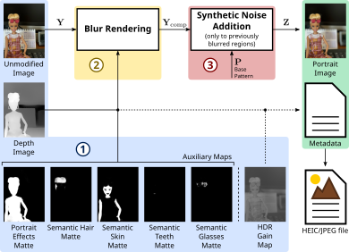
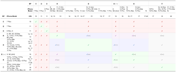
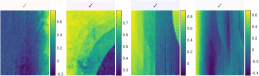
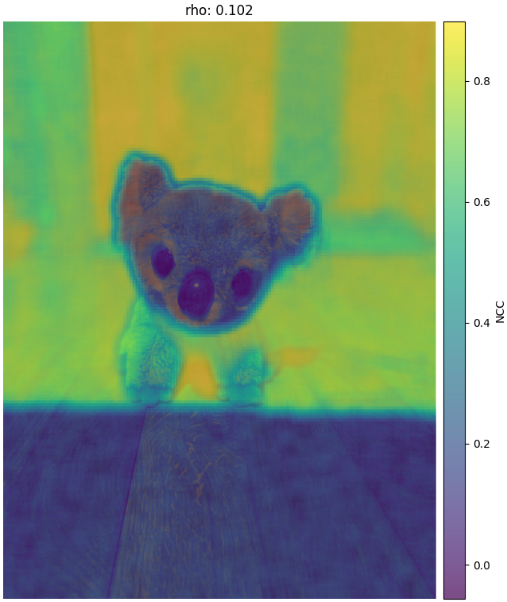
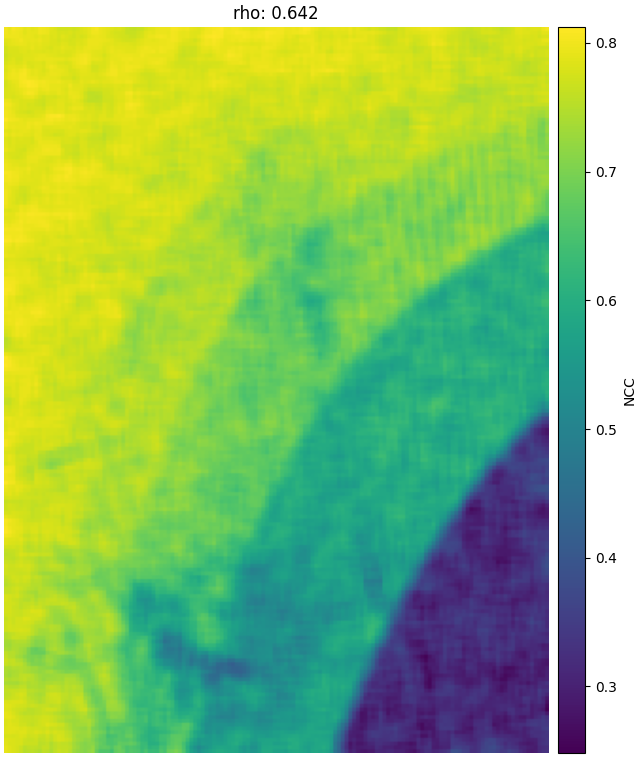

# Apple's Synthetic Defocus Noise Pattern (SDNP)
Official repository for the paper:

> D. Vázquez-Padín, F. Pérez-González and P. Pérez-Miguélez, "Apple’s Synthetic Defocus Noise Pattern: Characterization and Forensic Applications," in IEEE Transactions on Information Forensics and Security, vol. 21, pp. 1096-1111, 2026, doi: 10.1109/TIFS.2026.3653213.

Paper available at:  
https://ieeexplore.ieee.org/abstract/document/11346806

[](https://gpsc.uvigo.es/wp-content/uploads/2026/03/TIFS2026_dvazquez_fperez_pmperez.pdf)
[](https://gpsc.uvigo.es/wp-content/uploads/2026/03/TechRep_Apple_SDNP_dvazquez_fperez_pmperez.pdf)

### Citation

If you use this repository in your research, please cite:

```
@ARTICLE{APPLE_SDNP_2026,
  author={Vázquez-Padín, David and Pérez-González, Fernando and Pérez-Miguélez, Pablo},
  journal={IEEE Transactions on Information Forensics and Security}, 
  title={Apple's Synthetic Defocus Noise Pattern: Characterization and Forensic Applications}, 
  year={2026},
  volume={21},
  pages={1096-1111},
  doi={10.1109/TIFS.2026.3653213}}
```
---

# Overview

This repository provides the **reference Python implementation** and **characterization data** detailed in our study of Apple's Synthetic Defocus Noise Pattern (SDNP).



**Key Resources:**

- **Base Patterns (BPs):** our collection of BPs extracted from different Apple devices.
- **Analysis Tools:** Python code for:
  - BP detection
  - BP localization
  - BP comparison

These resources allow researchers to **reproduce the experiments**, **test new images**, and **analyze the presence of Apple's SDNP**.

*Note: Baseline PRNU-based source camera verification was performed using the Python implementation of the [Camera Fingerprint Program](https://dde.binghamton.edu/download/camera_fingerprint/).*

---

# Repository Structure
````
.
├── figs
│   ├── BP_comparison.png
│   ├── BP_compatibility_table.svg
│   ├── BP_localization.png
│   ├── partial_matches.svg
│   └── portrait_mode_diagram.svg
├── LICENSE
├── README.md
├── requirements.txt
└── src
    └── BP_utils.py
````

---

# Apple's BPs

The following **BPs** were extracted from Apple devices as described in the paper.

You may download specific patterns from the table below or grab the entire collection as a ZIP archive [here](https://ggl.link/zJOqJks).

| BP ID | Resolution | Portrait Lighting | Codec | Link                                 |
|-------|------------|-------------------|-------|--------------------------------------|
| BP ①  | 12MP       | NL                | JPEG  | [Download](https://ggl.link/sEs9ner) |
| BP ②  | 12MP       | NL                | JPEG  | [Download](https://ggl.link/A4F6FzF) |
| BP ③  | 12MP       | NL                | JPEG  | [Download](https://ggl.link/Jy4zqHy) |
| BP ④  | 12MP       | NL                | JPEG  | [Download](https://ggl.link/RdFHY9b) |
| BP ⑤  | 12MP       | NL                | HEIC  | [Download](https://ggl.link/7I9GvMD) |
| BP ⑤  | 12MP       | SLM               | HEIC  | [Download](https://ggl.link/ksu4bTR) |
| BP ⑥  | 12MP       | NL                | HEIC  | [Download](https://ggl.link/qPw72F3) |
| BP ⑥  | 12MP       | SLM               | HEIC  | [Download](https://ggl.link/NWOiNI0) |
| BP ⑥  | 24MP       | NL                | HEIC  | [Download](https://ggl.link/YXTC84N) |
| BP ⑥  | 24MP       | SLM               | HEIC  | [Download](https://ggl.link/XEXCRHz) |
| BP ⑦  | 12MP       | SLM               | HEIC  | [Download](https://ggl.link/HDg3Tsc) |
| BP ⑦  | 24MP       | SLM               | HEIC  | [Download](https://ggl.link/GldLK8c) |

**Note on BP ⑧:** as mentioned in the paper, BP ⑧ likely depends on image editing software (possibly Apple’s Photos app rather than the camera pipeline). It is therefore excluded from the [Apple's BP Compatibility](#apples-bp-compatibility) table below, but can be downloaded separately [here](https://ggl.link/fzvFYjJ) (12MP, NL, JPEG).

All patterns are stored as **MATLAB (`.mat`)** files.

Example of loading a BP in Python:

```python
from scipy.io import loadmat

data = loadmat("/path/to/base_patterns/BP06_12MP_HEIC_SLM.mat")
BP = data["BP"]
````

---

# Apple's BP Compatibility

The following table summarizes the **BP Compatibility** across different iPhone models at 12MP resolution.



Table legend:

<span style="color:green">✔</span>: **Full Match**  
<span style="color:red">✖</span>: **Incompatible**  
**(↔)**: **Horizontal Flip** between BPs

**Partial Matches** are categorized into four types based on their specific NCC map characteristics:



---

# BP Detection

Use this module to verify whether a specific BP (or any BP from a given folder) is present in a target image or in a collection of images.

Example usage:

```python
from BP_utils import detect_BP

BP_path = "/path/to/BP_folder_or_mat_file"
im_path = "/path/to/image_folder_or_image_file"

meta_det_BP = detect_BP(BP_path, im_path)
```
The `detect_BP` function returns a **list of dictionaries**, where each element corresponds to one processed image.

Each dictionary contains the detection results for that image.

If a BP is detected (i.e., the maximum correlation value `ρ(W,P)` exceeds the threshold `β`), the dictionary contains:

| Field        | Description                                                                                                           |
|--------------|-----------------------------------------------------------------------------------------------------------------------|
| `Filename`   | Path to the analyzed image.                                                                                           |
| `rho`        | Maximum correlation value between the image residue and the set of BPs.                                               |
| `BP_ref`     | Name of the reference BP file that produced the highest correlation.                                                  |
| `rotation_k` | Rotation index of the detected BP (`0`, `1`, `2`, `3` corresponding to rotations of `0°`, `90°`, `180°`, and `270°`). |

If **no BP is detected** (i.e., `ρ ≤ β`), the dictionary contains:

| Field        | Value                               |
|--------------|-------------------------------------|
| `Filename`   | Path to the analyzed image.         |
| `rho`        | Maximum correlation value obtained. |
| `BP_ref`     | `None`                              |
| `rotation_k` | `None`                              |

---

# BP Localization

This module **localizes the BP** within an image and generates the BP-driven NCC map and also the binary mask for PRNU-based source camera verification.

Example usage:

```python
from BP_utils import BP_driven_NCC_map, load_image
from scipy.io import loadmat

BP_path = "/path/to/BP_mat_file"
im_path = "/path/to/image_file"

# Load BP
data = loadmat(BP_path)
BP = data["BP"]

# Load image in grayscale
I = load_image(im_path)

NCCmap, Mask = BP_driven_NCC_map(BP, I)
```

*Note: The `BP` and the image `I` must have identical dimensions. If the pattern needs to be rotated, use the rotation information provided in the metadata returned by the `detect_BP` function (see the code of the example `BP_detection_and_localization_example` below).*

---

# BP Detection and Localization Example

Example usage:

```python
from BP_utils import BP_detection_and_localization_example

BP_path = "/path/to/BP04_12MP_NL_JPEG.mat"
im_path = "/path/to/C21/bokeh/01 (6).jpg"
BP_detection_and_localization_example(BP_path, im_path)
```

Expected Output:



**Note:** Image taken from the [Dataset](https://lesc.dinfo.unifi.it/PrnuModernDevices/) used in the experiments reported by Albisani *et al.* in "Checking PRNU Usability on Modern Devices," IEEE International Conference on Acoustics, Speech and Signal Processing (ICASSP). IEEE, 2021.

---

# BP Comparison Example


Example usage:

```python
from BP_utils import BP_comparison_example

BP1_path = "/path/to/BP06_12MP_NL_HEIC.mat"
BP2_path = "/path/to/BP04_12MP_NL_JPEG.mat"
BP_comparison_example(BP1_path, BP2_path, b_flip=True)
```

Expected Output:



---

# Requirements

Python ≥ 3.12

Required packages:
```
numpy
opencv-python
scikit-image
scipy
pillow
pillow-heif
matplotlib
```

Install:

```
pip install -r requirements.txt
```

---

# Image Dataset
The complete dataset, including released images and JSON files containing Flickr image URLs, is available as a ZIP archive [here](https://ggl.link/AyEXwzp). The table below summarizes the availability and source of the images associated with each analyzed device. Note that the paper only includes devices up to D97; additional devices were added afterward. Cases where `Released Images < Total Images` indicate that some images were excluded due to privacy constraints (e.g., identifiable human faces) or licensing restrictions, as detailed below the table.

| ID  | Model             | Released / Total | Availability        | Source                                                                                         |
|-----|-------------------|------------------|---------------------|------------------------------------------------------------------------------------------------|
| D01 | iPhone 7 Plus     | 0 / 19           | Upon request        | [Iuliani *et al.*, 2021](https://doi.org/10.1109/ACCESS.2021.3070478)                          |
| D02 | iPhone 7 Plus     | 311 / 311        | Flickr references   | [JSON](https://ggl.link/9hqacY2)                                                               |
| D03 | iPhone 7 Plus     | 46 / 46          | Flickr references   | [JSON](https://ggl.link/lvGauUN)                                                               |
| D04 | iPhone 7 Plus     | 12 / 12          | Flickr references   | [JSON](https://ggl.link/HR3zHOn)                                                               |
| D05 | iPhone 7 Plus     | 13 / 13          | Flickr references   | [JSON](https://ggl.link/S3g6C5H)                                                               |
| D06 | iPhone 7 Plus     | 118 / 118        | Flickr references   | [JSON](https://ggl.link/VYM1l1s)                                                               |
| D07 | iPhone 7 Plus     | 0 / 2            | External (GSMArena) | [iPhone 7 Plus review](https://www.gsmarena.com/apple_iphone_7_plus-review-1506p8.php)         |
| D08 | iPhone 8 Plus     | 0 / 11           | Upon request        | [Iuliani *et al.*, 2021](https://doi.org/10.1109/ACCESS.2021.3070478)                          |
| D09 | iPhone 8 Plus     | 0 / 16           | Upon request        | [Iuliani *et al.*, 2021](https://doi.org/10.1109/ACCESS.2021.3070478)                          |
| D10 | iPhone 8 Plus     | 61 / 61          | Flickr references   | [JSON](https://ggl.link/gDXSWIy)                                                               |
| D11 | iPhone 8 Plus     | 17 / 17          | Flickr references   | [JSON](https://ggl.link/ktRF1ot)                                                               |
| D12 | iPhone 8 Plus     | 0 / 13           | External (GSMArena) | [iPhone 8 Plus review](https://www.gsmarena.com/apple_iphone_8_plus-review-1662p9.php)         |
| D13 | iPhone X          | 0 / 8            | External            | [C19 - Albisani *et al.*, 2021](https://lesc.dinfo.unifi.it/PrnuModernDevices/C19/bokeh/)      |
| D14 | iPhone X          | 0 / 21           | Upon request        | [Baracchi *et al.*, 2021](https://doi.org/10.1007/978-3-030-69449-4_15)                        |
| D15 | iPhone X          | 0 / 43           | Upon request        | [Baracchi *et al.*, 2021](https://doi.org/10.1007/978-3-030-69449-4_15)                        |
| D16 | iPhone X          | 0 / 140          | Upon request        | [Baracchi *et al.*, 2021](https://doi.org/10.1007/978-3-030-69449-4_15)                        |
| D17 | iPhone X          | 22 / 22          | Flickr references   | [JSON](https://ggl.link/kYAb2hy)                                                               |
| D18 | iPhone X          | 8 / 44           | Flickr references   | [JSON](https://ggl.link/ONJEgbv)                                                               |
| D19 | iPhone X          | 23 / 23          | Flickr references   | [JSON](https://ggl.link/SaixIFH)                                                               |
| D20 | iPhone X          | 0 / 9            | External (GSMArena) | [iPhone X review](https://www.gsmarena.com/apple_iphone_x-review-1681p9.php)                   |
| D21 | iPhone X          | 24 / 24          | Direct download     | [ZIP](https://ggl.link/NvWfuiW)                                                                |
| D22 | iPhone XR         | 0 / 9            | Upon request        | [Iuliani *et al.*, 2021](https://doi.org/10.1109/ACCESS.2021.3070478)                          |
| D23 | iPhone XR         | 0 / 15           | Upon request        | [Baracchi *et al.*, 2021](https://doi.org/10.1007/978-3-030-69449-4_15)                        |
| D24 | iPhone XR         | 0 / 5            | External (GSMArena) | [iPhone XR review](https://www.gsmarena.com/iphone_xr-review-1842p6.php)                       |
| D25 | iPhone XS         | 0 / 11           | External (GSMArena) | [iPhone XS review](https://www.gsmarena.com/apple_iphone_xs-review-1827p7.php)                 |
| D26 | iPhone XS Max     | 0 / 10           | Upon request        | [Baracchi *et al.*, 2021](https://doi.org/10.1007/978-3-030-69449-4_15)                        |
| D27 | iPhone XS Max     | 0 / 12           | External (GSMArena) | [iPhone XS Max review](https://www.gsmarena.com/apple_iphone_xs_max-review-1829p7.php)         |
| D28 | iPhone 11         | 0 / 11           | Upon request        | [Iuliani *et al.*, 2021](https://doi.org/10.1109/ACCESS.2021.3070478)                          |
| D29 | iPhone 11         | 0 / 3            | Upon request        | [Iuliani *et al.*, 2021](https://doi.org/10.1109/ACCESS.2021.3070478)                          |
| D30 | iPhone 11         | 0 / 10           | External            | [C20 - Albisani *et al.*, 2021](https://lesc.dinfo.unifi.it/PrnuModernDevices/C20/bokeh/)      |
| D31 | iPhone 11         | 0 / 10           | External            | [C21 - Albisani *et al.*, 2021](https://lesc.dinfo.unifi.it/PrnuModernDevices/C21/bokeh/)      |
| D32 | iPhone 11         | 0 / 5            | Restricted          | Not publicly redistributable                                                                   |
| D33 | iPhone 11         | 0 / 9            | External (GSMArena) | [iPhone 11 review](https://www.gsmarena.com/apple_iphone_11-review-1993p7.php)                 |
| D34 | iPhone 11         | 20 / 20          | Direct download     | [ZIP](https://ggl.link/uMoDtTO)                                                                |
| D35 | iPhone 11 Pro     | 0 / 29           | Upon request        | [Iuliani *et al.*, 2021](https://doi.org/10.1109/ACCESS.2021.3070478)                          |
| D36 | iPhone 11 Pro     | 0 / 62           | Upon request        | [Iuliani *et al.*, 2021](https://doi.org/10.1109/ACCESS.2021.3070478)                          |
| D37 | iPhone 11 Pro     | 0 / 28           | Upon request        | [Iuliani *et al.*, 2021](https://doi.org/10.1109/ACCESS.2021.3070478)                          |
| D38 | iPhone 11 Pro     | 4 / 4            | Direct download     | [ZIP](https://ggl.link/c0lnFBl)                                                                |
| D39 | iPhone 11 Pro Max | 0 / 12           | External            | [C22 - Albisani *et al.*, 2021](https://lesc.dinfo.unifi.it/PrnuModernDevices/C22/bokeh/)      |
| D40 | iPhone 11 Pro Max | 0 / 13           | External (GSMArena) | [iPhone 11 Pro Max review](https://www.gsmarena.com/apple_iphone_11_pro_max-review-1991p7.php) |
| D41 | iPhone 11 Pro Max | 20 / 20          | Direct download     | [ZIP](https://ggl.link/HZjXbzM)                                                                |
| D42 | iPhone SE (2nd)   | 0 / 4            | External (GSMArena) | [iPhone SE (2nd) review](https://www.gsmarena.com/apple_iphone_se_2020-review-2108p5.php)      |
| D43 | iPhone SE (2nd)   | 18 / 20          | Direct download     | [ZIP](https://ggl.link/NZuIPoM)                                                                |
| D44 | iPhone 12         | 0 / 52           | Flickr references   | Not publicly redistributable                                                                   |
| D45 | iPhone 12         | 0 / 6            | Flickr references   | Not publicly redistributable                                                                   |
| D46 | iPhone 12         | 0 / 7            | External (GSMArena) | [iPhone 12 review](https://www.gsmarena.com/apple_iphone_12-review-2187p5.php)                 |
| D47 | iPhone 12 mini    | 0 / 3            | Flickr references   | Not publicly redistributable                                                                   |
| D48 | iPhone 12 mini    | 0 / 27           | Flickr references   | Not publicly redistributable                                                                   |
| D49 | iPhone 12 mini    | 0 / 11           | Flickr references   | Not publicly redistributable                                                                   |
| D50 | iPhone 12 mini    | 0 / 8            | External (GSMArena) | [iPhone 12 mini review](https://www.gsmarena.com/apple_iphone_12_mini-review-2197p5.php)       |
| D51 | iPhone 12 mini    | 67 / 110         | Direct download     | [ZIP](https://ggl.link/ORPXkp2)                                                                |
| D52 | iPhone 12 Pro     | 0 / 18           | External (GSMArena) | [iPhone 12 Pro review](https://www.gsmarena.com/apple_iphone_12_pro-review-2189p7.php)         |
| D53 | iPhone 12 Pro     | 20 / 20          | Direct download     | [ZIP](https://ggl.link/kRVQYxJ)                                                                |
| D54 | iPhone 12 Pro Max | 0 / 17           | External (GSMArena) | [iPhone 12 Pro Max review](https://www.gsmarena.com/apple_iphone_12_pro_max-review-2200p7.php) |
| D55 | iPhone 13         | 0 / 100          | Flickr references   | Not publicly redistributable                                                                   |
| D56 | iPhone 13         | 0 / 4            | External (GSMArena) | [iPhone 13 review](https://www.gsmarena.com/apple_iphone_13-review-2325p5.php)                 |
| D57 | iPhone 13         | 20 / 20          | Direct download     | [ZIP](https://ggl.link/d883rJE)                                                                |
| D58 | iPhone 13         | 20 / 20          | Direct download     | [ZIP](https://ggl.link/COJYgnG)                                                                |
| D59 | iPhone 13         | 20 / 20          | Direct download     | [ZIP](https://ggl.link/yqkFe1e)                                                                |
| D60 | iPhone 13         | 18 / 18          | Direct download     | [ZIP](https://ggl.link/AKNfIkX)                                                                |
| D61 | iPhone 13         | 20 / 20          | Direct download     | [ZIP](https://ggl.link/jCeqU4i)                                                                |
| D62 | iPhone 13 mini    | 0 / 2            | External (GSMArena) | [iPhone 13 mini review](https://www.gsmarena.com/apple_iphone_13_mini-review-2333p5.php)       |
| D63 | iPhone 13 mini    | 20 / 20          | Direct download     | [ZIP](https://ggl.link/5CKw3Kr)                                                                |
| D64 | iPhone 13 Pro     | 76 / 76          | Flickr references   | [JSON](https://ggl.link/VafCsVT)                                                               |
| D65 | iPhone 13 Pro     | 10 / 10          | Flickr references   | [JSON](https://drive.google.com/file/d/1kGs7ozUNP5QzD_wprgRPvGeFNP6keCVJ/view?usp=drive_link)  |
| D66 | iPhone 13 Pro     | 0 / 12           | External (GSMArena) | [iPhone 13 Pro review](https://www.gsmarena.com/apple_iphone_13_pro-review-2331p5.php)         |
| D67 | iPhone 13 Pro Max | 0 / 14           | External (GSMArena) | [iPhone 13 Pro Max review](https://www.gsmarena.com/apple_iphone_13_pro_max-review-2326p6.php) |
| D68 | iPhone 13 Pro Max | 20 / 20          | Direct download     | [ZIP](https://drive.google.com/file/d/1ZD7sHoMZm1Wumpcdu2IU3IqrviltvQnF/view?usp=drive_link)   |
| D69 | iPhone 13 Pro Max | 13 / 13          | Direct download     | [ZIP](https://drive.google.com/file/d/1p3ZHAKeVaywQIeAgN1zekY4KR6wkFqMP/view?usp=drive_link)   |
| D70 | iPhone SE (3rd)   | 0 / 6            | External (GSMArena) | [iPhone SE (3rd) review](https://www.gsmarena.com/apple_iphone_se_2022-review-2405p5.php)      |
| D71 | iPhone 14         | 0 / 6            | External (GSMArena) | [iPhone 14 review](https://www.gsmarena.com/apple_iphone_14-review-2481p5.php)                 |
| D72 | iPhone 14         | 20 / 20          | Direct download     | [ZIP](https://drive.google.com/file/d/1ALBH5kwxZfpCz_CS1T6BYGEuqEoq634Z/view?usp=drive_link)   |
| D73 | iPhone 14         | 20 / 20          | Direct download     | [ZIP](https://drive.google.com/file/d/1DAu8OlP0xEsu_4Vgyydmnt3898JB2ihL/view?usp=drive_link)   |
| D74 | iPhone 14 Plus    | 0 / 8            | External (GSMArena) | [iPhone 14 Plus review](https://www.gsmarena.com/apple_iphone_14_plus-review-2493p5.php)       |
| D75 | iPhone 14 Pro     | 0 / 14           | External (GSMArena) | [iPhone 14 Pro review](https://www.gsmarena.com/apple_iphone_14_pro-review-2480p6.php)         |
| D76 | iPhone 14 Pro Max | 13 / 13          | Direct download     | [ZIP](https://drive.google.com/file/d/1tGSOmRdCzo1Wyh8JvvKlEzamKgHUnRkP/view?usp=drive_link)   |
| D77 | iPhone 14 Pro Max | 0 / 4            | Flickr references   | Not publicly redistributable                                                                   |
| D78 | iPhone 14 Pro Max | 0 / 18           | External (GSMArena) | [iPhone 14 Pro Max review](https://www.gsmarena.com/apple_iphone_14_pro_max-review-2482p6.php) |
| D79 | iPhone 14 Pro Max | 20 / 20          | Direct download     | [ZIP](https://drive.google.com/file/d/1N3BTK1TJAZlye1GumXOctnCN69fgyyrp/view?usp=drive_link)   |
| D80 | iPhone 14 Pro Max | 14 / 14          | Direct download     | [ZIP](https://drive.google.com/file/d/1JgGirpbbO-BJP_zLBGXfXrUHHwCfnX80/view?usp=drive_link)   |
| D81 | iPhone 15         | 112 / 113        | Direct download     | [ZIP](https://drive.google.com/file/d/1q08X-rNXNDa_nmh_mnoLvC6AgtenK3PS/view?usp=drive_link)   |
| D82 | iPhone 15         | 0 / 5            | Flickr references   | Not publicly redistributable                                                                   |
| D83 | iPhone 15         | 0 / 17           | External (GSMArena) | [iPhone 15 review](https://www.gsmarena.com/apple_iphone_15-review-2619p5.php)                 |
| D84 | iPhone 15         | 2 / 2            | Direct download     | [ZIP](https://drive.google.com/file/d/1Cl88pPRD9AFHJroI4n-NiQhILKXuk844/view?usp=drive_link)   |
| D85 | iPhone 15 Plus    | 0 / 10           | External (GSMArena) | [iPhone 15 Plus review](https://www.gsmarena.com/apple_iphone_15_plus-review-2621p5.php)       |
| D86 | iPhone 15 Pro     | 0 / 18           | External (GSMArena) | [iPhone 15 Pro review](https://www.gsmarena.com/apple_iphone_15_pro-review-2620p5.php)         |
| D87 | iPhone 15 Pro Max | 0 / 18           | External (GSMArena) | [iPhone 15 Pro Max review](https://www.gsmarena.com/apple_iphone_15_pro_max-review-2618p6.php) |
| D88 | iPhone 16         | 35 / 50          | Direct download     | [ZIP](https://drive.google.com/file/d/1hLsHKwaTXMm_agLT2YlfOz4qgGO4n9JZ/view?usp=drive_link)   |
| D89 | iPhone 16         | 0 / 8            | External (GSMArena) | [iPhone 16 review](https://www.gsmarena.com/apple_iphone_16-review-2749p5.php)                 |
| D90 | iPhone 16 Plus    | 0 / 8            | External (GSMArena) | [iPhone 16 Plus review](https://www.gsmarena.com/apple_iphone_16_plus-review-2751p5.php)       |
| D91 | iPhone 16 Pro     | 0 / 6            | External (GSMArena) | [iPhone 16 Pro review](https://www.gsmarena.com/apple_iphone_16_pro-review-2752p5.php)         |
| D92 | iPhone 16 Pro Max | 0 / 6            | External (GSMArena) | [iPhone 16 Pro Max review](https://www.gsmarena.com/apple_iphone_16_pro_max-review-2750p5.php) |
| D93 | iPhone 16e        | 0 / 4            | External (GSMArena) | [iPhone 16e review](https://www.gsmarena.com/apple_iphone_16e-review-2805p5.php)               |
| D94 | iPhone 17         | 0 / 4            | External (GSMArena) | [iPhone 17 review](https://www.gsmarena.com/apple_iphone_17-review-2886p6.php)                 |
| D95 | iPhone 17 Pro     | 0 / 4            | External (GSMArena) | [iPhone 17 Pro review](https://www.gsmarena.com/apple_iphone_17_pro-review-2887p5.php)         |
| D96 | iPhone 17 Pro Max | 0 / 4            | External (GSMArena) | [iPhone 17 Pro Max review](https://www.gsmarena.com/apple_iphone_17_pro_max-review-2884p6.php) |
| D97 | iPhone Air        | 0 / 4            | External (GSMArena) | [iPhone Air review](https://www.gsmarena.com/apple_iphone_air-review-2885p6.php)               |
| D98 | iPhone 17e        | 0 / 4            | External (GSMArena) | [iPhone 17e review](https://www.gsmarena.com/apple_iphone_17e-review-2945p5.php)               |

**Notes**

- To comply with privacy and data protection regulations, including the [General Data Protection Regulation (GDPR)](https://eur-lex.europa.eu/legal-content/EN/TXT/PDF/?uri=CELEX:02016R0679-20160504), images containing identifiable human faces are excluded from the public release. As a result, the number of released images may differ from the values reported in Table 6 of the [technical report](https://doi.org/10.13140/RG.2.2.24810.58567).

- Several Flickr images (mostly from D44, D45, D47, D48, D49, D55, D77, and D82) are not redistributed due to licensing restrictions. In particular, images marked as "All rights reserved" are excluded. In accordance with Flickr licensing terms, only images with permissive licenses (e.g., Creative Commons) are redistributed.

- Images collected from [GSMArena](https://www.gsmarena.com/) are not redistributed due to copyright and licensing restrictions. Researchers interested in these images should obtain them directly from the corresponding links to the original website, in accordance with its terms of use.
 
- All GPS metadata was removed from the released images using [ExifTool](https://exiftool.org/) before publication.

- Two images from C19 (iPhone X) contain EXIF metadata indicating an iPhone 11 Pro Max source device, possibly corresponding to C22.

---

# License

This project is licensed under the [Apache License 2.0](http://www.apache.org/licenses/LICENSE-2.0). See the `LICENSE` file for more details.

---

# Contact

For questions regarding the repository or the paper, please contact: David Vázquez-Padín ([dvazquez@gts.uvigo.es](mailto:dvazquez@gts.uvigo.es))